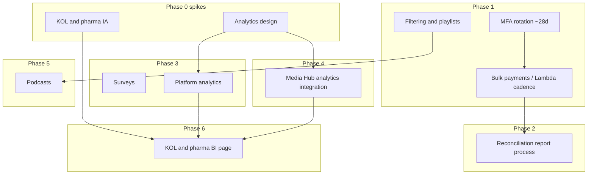

# Post-MVP product roadmap — executive briefing

Strategic roadmap for work following MVP delivery: phased initiatives, sequencing, financing controls, dependencies, and reference material for stakeholder alignment. Operational detail resides in engineering documentation referenced below.

---

## Strategic themes

| Theme | Outcome |
|--------|---------|
| **Operations & disbursements** | Reduced manual intervention, predictable Bill.com–aligned payouts, audit-ready finance processes. |
| **Analytics & data** | Consolidated insights for operational and sponsor decision-making; alignment with Community Health Media (Media Hub) where integrated. |
| **Learner experience & content** | Improved discovery through filters and playlists; expanded formats including podcasts. |
| **Commercial / partner** | Defined experiences for Key Opinion Leaders (KOL) and pharmaceutical partners, supported by deliberate information design rather than incremental page-level additions. |

---

## Phase 0 — Design foundations (parallel discovery)

Design and architecture work undertaken in parallel with delivery to constrain rework and clarify scope downstream.

| Focus area | Scope |
|------------|--------|
| **Analytics architecture** | Event definitions, persona-based dashboards (learner, administrator, partner), success metrics—including completion, retention, disbursements, and attendance. Architectural choice between data warehouse versus in-application aggregates where applicable. |
| **KOL, pharmaceutical & BI interfaces** | Information architecture and measurable success criteria for sponsor-facing outputs (beyond marketing-only surfaces). |

**Dependencies:** Stakeholder input; informs Phase 3 and Media Hub analytics integration.

---

## Phase 1 — Operational stability & platform refinement (immediate post-MVP)

**Objective.** Establish dependable operations after MVP launch and visible quality improvements without requiring net-new core product pillars.

| Initiative | Description |
|----------------|-------------|
| **Bulk / scheduled disbursements** | Automated background execution (for example Lambda on fifteen-minute cadence, subject to Bill.com constraints) for queued payouts, complementing administrator-initiated payment flows and reducing reliance on repetitive manual disbursement handling. |
| **Credential rotation (approximately 28 days)** | Proactive rotation of MFA and remember-me identifiers prior to customary thirty-day cycles to align batch disbursement jobs and privileged sessions with monitoring and predictable renewal—mitigating mid-cycle authentication failures tied to payout automation. Reference: [payment APIs](payment-apis.md), Bill session behavior. |
| **Discovery: filters & playlists** | Improvements to filtering and playlist capabilities to strengthen content organization and reduce post-MVP support load. |

**Recommended sequencing.** Disbursement automation and session/credential hygiene as a jointly sequenced milestone on the disbursement pathway; thereafter, discovery-related user experience enhancements.

---

## Phase 2 — Finance controls & reconciliation

**Objective.** Enable finance and accounting teams to execute period-close activities without reliance on improvised spreadsheets as the sole system of reconciliation.

| Initiative | Description |
|----------------|-------------|
| **Automated reconciliation reporting** | Batch process producing interval-based extracts (CSV/Excel-compatible) reconciling platform payment records against Bill.com identifiers; control totals and exception identification. Specifications in [Appendix: Payment reconciliation (accounting)](#appendix-payment-reconciliation-accounting). |

**Dependencies.** Stable payment identifiers resulting from Phase 1 disbursement modernization. Incremental deployment is viable: Phase A aggregates from primary data stores plus supplementary Bill extracts; Phase B expands to API-mediated reconciliation once integration patterns stabilize.

---

## Phase 3 — In-product analytics & surveys

**Objective.** Operational and program-management insight natively within the Community Health Media platform rather than dispersed across disparate tools where avoidable.

| Initiative | Description |
|----------------|-------------|
| **Surveys** | Structured learner and program-feedback capture aligned to milestones (for example following office-hours or webinars), with persisted storage and administrator visibility. Prioritization favors a narrowly scoped journey before broader rollout. |
| **Platform analytics** | Dashboard or embedded analytic views anchored to Phase 0 definitions—including activation, completion, funnel milestones, role-appropriate disbursement summaries. |

**Dependencies.** Completion of Phase 0 analytics foundations. Audience distinction: product and program analytics versus reconciliation metrics intended for accounting (Phase 2).

---

## Phase 4 — Cross-property analytics integration

**Objective.** Coherent analytic narrative bridging Media Hub and the CHM platform.

| Initiative | Description |
|----------------|-------------|
| **Media Hub ↔ CHM analytics** | Aligned identifiers, consent posture, delivery model options (embedded dashboards, synchronized events, centralized warehouse)—contingent on Phase 0 direction and patterns documented under [Media Hub API](MEDIAHUB-API.md), subject to update as integration design finalizes. |

**Dependencies.** Phase 0 outcomes and stabilized internal analytic contracts precede enterprise-wide integration commitments.

---

## Phase 5 — Content expansion

**Objective.** Expanded catalog richness while preserving navigational coherence established during Phase 1.

| Initiative | Description |
|----------------|-------------|
| **Podcasts** | Dedicated learner-facing surface integrating playback and metadata modeling, consistent with playlist and discovery patterns developed in preceding phases. |

**Dependencies.** Phase 1 discovery and playlist design patterns constrain duplicate layout rework.

---

## Phase 6 — Partner & revenue readiness

**Objective.** Reliable sponsor-facing analytics and differentiated experiences for pharmaceutical and leadership stakeholders.

| Initiative | Description |
|----------------|-------------|
| **KOL & pharmaceutical portals & BI** | Public or entitlement-gated interfaces delivering business intelligence (engagement segments, completions, attributable outcomes), consistent with Phase 0 design commitments. |

**Dependencies.** Phase 3 analytic implementation; optionally Phase 4 for unified cross-property reporting.

---

## Cross-phase dependency overview

---

## Prioritized focus under constraint

Should prioritization narrow to discrete deliverables initially, recommended ordering is:

1. **Scheduled / bulk disbursements** jointly with **MFA/session rotation** — stabilizes disbursement throughput and privileged access patterns.
2. **Reconciliation reporting** ([appendix](#appendix-payment-reconciliation-accounting)) — satisfies finance-period requirements and strengthens control environment narrative.
3. **Phase 0 analytics design completion** — single coherent foundation supporting surveys, internal dashboards, Media Hub linkage, and sponsor BI.
4. **Filters / playlists**, then **podcasts** — externally visible enhancements to learner satisfaction and content breadth.
5. **Media Hub analytics integration**, then **KOL / pharmaceutical BI** — after internal analytic schemas and integrations are anchored.

---

## Reference documentation

- [Payment APIs](payment-apis.md)
- [Media Hub API](MEDIAHUB-API.md)

---

## Document governance

Quarterly—or upon material change to MVP baseline or sponsor commitments—leadership review is recommended so this roadmap reflects current prioritization.

---

## Appendix: Payment reconciliation (accounting)

### Purpose

A discrete operational process—not conflated with standard pay flows—yielding periodic **reconciliation extracts** verifying that platform-recorded payments align with Bill.com disbursements (and downstream bank activity where applicable).

Support for monthly or discretionary period-close is intended to incorporate auditable lineage: monetary amounts, payee references, transactional dates, lifecycle status.

Operational payment flows—including onboarding, queue management, administrator Pay now initiation—remain per [payment APIs](payment-apis.md); this appendix addresses financial control and supervisory reporting.

### Current gap

Ledger activity is maintained application-side and executes through Bill.com; finance nevertheless requires structured exports to:

- Reconcile internal payment records to Bill.com payment and vendor identifiers by reporting interval.
- Summarize aggregates by transactional status (pending, cleared, exceptions if modeled administratively).
- Surface variance between application state and clearinghouse state without uncompensated manual spreadsheet reconciliation across high-volume histories.

### Target state

Automated workload (scheduled batch compute; cadence—for example daily with ad hoc remediation—subject to stakeholder approval), performing:

1. Retrieve authoritative disbursement payloads for parameterized windows (baseline defaults often prior operational day or month).
2. Enrich extracts with accountant-relevant correlators (Bill payment identifier, vendor profile, ACH or check lineage where exposed by API contracts).
3. Publish reconciliation-grade outputs: machine-readable CSV (or workbook-compatible equivalents) to hardened storage optionally augmented by structured payloads for supervisory tooling integration.
4. Non-sensitive notification channels may signal availability of secured artifacts omitting substantive PII within message bodies.

### Report structure (representative baseline)

Subject to finance sign-off—illustrative field structure:

| Field | Guidance |
|--------|----------|
| Report interval / compilation timestamp | Coordinated Universal Time aligned to organizational timezone |
| Platform payment surrogate key | Immutable internal identifier |
| Payee nomenclature | Administrator-visible designation |
| Bill vendor correlation | Provisioned onboarding relationship |
| Bill payment correlation | Post–Pay now affirmation |
| Denominated amount | Single canonical precision |
| Operational status | Lifecycle state within platform workflows |
| Initiation / settlement timestamps | ISO-8601 presentation |
| Attributional source | Program linkage where modeled |

Supplementary elements frequently specified:

- Aggregate control footing (sums by cleared versus queued volume; deterministic row cardinalities).
- Exception registers upon introduction of deterministic database-to-clearing compare logic.

### Technical approach (summarized)

1. Primary persistence layer: existing payment tables augmented by Bill-derived correlation stored at disbursement initiation.
2. Phasing: initial publication from authoritative database alongside manually imported clearing extracts establishes governance quickly; succeeding releases introduce API-mediated Bill reconciliation subject to stabilized authentication contracts described in engineering payment documentation.
3. Infrastructure alignment: shared deployment patterns with disbursement automation (IAM, network isolation, confidentiality management, centralized logging)—reconciliation execution isolated independently to constrain blast radius from disbursement refactor events.

### Security & retention

Artifacts retain personally identifiable attributes and fiduciary identifiers requiring encrypted private object storage with least-privilege access controls and audited retrieval paths consistent with institutional policy frameworks (retention aligning with customary seven-year horizons or formally adopted enterprise policy superseding illustrative baseline).

### Reconciliation prerequisites

- Operational alignment with contractual Bill integration behavior ([payment APIs](payment-apis.md)).
- Finance-defined reporting cadence (daily, weekly, or month-end-aligned).

### Decisions awaiting finance endorsement

- Fiscal calendar boundary definitions versus trailing operational windows for extract windows.
- File format conformance (comma-separated values, workbook formats, interoperability with bookkeeping platforms).
- Multi-tenant scope should organizational structure expand beyond consolidated reporting domains.

### Roadmap alignment

Initiative corresponds to Phase 1 (disbursement pipeline stability and deterministic identifiers), Phase 2 (regulated reconciliation outputs), and coordination with disbursement scaling and MFA rotation so operational failures surface visibly prior to supervisory close.
