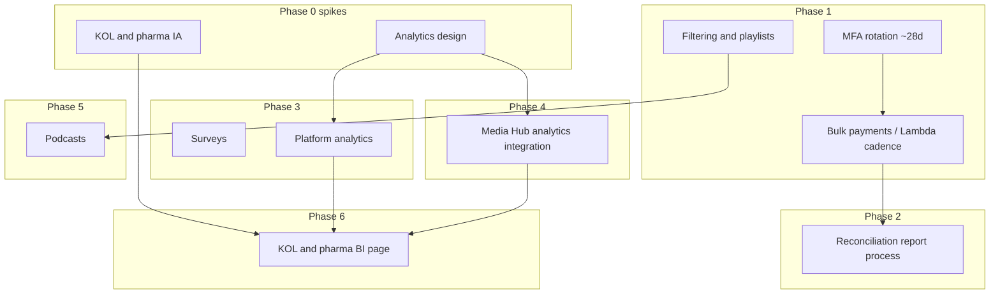

# Post-MVP roadmap: next steps & phases

This document consolidates **planned work after the MVP presentation**: phases, dependencies, reconciliation detail, and pointers to adjacent specs (`payment-apis`, Media Hub).

---

## Themes

| Theme | Goal |
|--------|------|
| **Operations & payouts** | Less manual intervention, reliable Bill.com workflows, audit-friendly finance. |
| **Analytics & data** | One place for product and partner insights; align with Media Hub. |
| **Learner UX & content** | Better discovery (filters, playlists) and richer formats (podcasts). |
| **Commercial / partner** | Clear surfaces for KOL and pharmaceutical stakeholders—designed intentionally, not improvised. |

---

## Phase 0 — Design spikes (parallel, unblock build)

Complete before or alongside heavy engineering so you avoid rework.

- **Analytics design** — Event vocabulary, dashboards per persona (learner, admin, partner), success metrics (completion, retention, payouts, attendance). Decide warehouse vs in-app aggregates.
- **KOL / pharma / BI surfaces** — Information architecture and what “good” looks like for sponsors (reports, not only marketing pages).

*Dependencies:* Stakeholder workshops; aligns Phase 3 and Media Hub integration.

---

## Phase 1 — Stability, money flow, hygiene (near term)

**Objective:** Reliable operations immediately after MVP; visible UX wins without new product pillars.

| Item | Description |
|------|-------------|
| **Bulk / scheduled payments** | Background process (e.g. Lambda on a **15-minute** cadence, or cadence tuned with Bill.com limits) to progress queued payouts and reduce purely manual Pay-now churn. |
| **MFA / remember-me rotation (~28 days)** | Automate rotation **ahead** of typical ~30-day trust boundaries so batch jobs and admin sessions fail predictably—with monitoring—rather than mid-month surprises. Works with payout automation. See [payment APIs](payment-apis.md) re: Bill session semantics. |
| **Filtering fixes & more playlists** | Improve discovery and organization of learning/content; lowers support burden post-MVP. |

**Suggested order:** bulk/scheduled payouts + MFA/session health **together** (money path), then filtering/playlists UX.

---

## Phase 2 — Finance controls & reconciliation

**Objective:** Accounting can close periods without ad hoc spreadsheets.

| Item | Description |
|------|-------------|
| **Reconciliation report process** | Dedicated batch that outputs period-based **CSV/Excel-ready** files: platform payments vs Bill.com identifiers; control totals and exception lists—full spec in [Appendix: Payment reconciliation (accounting)](#appendix-payment-reconciliation-accounting). |

*Dependency:* Stable payment fields and IDs from Phase 1; can ship **Phase A** (report from DB + manual Bill extracts) before full API reconciliation.

---

## Phase 3 — In-product analytics & surveys

**Objective:** Enough insight to run programs **inside** CHM instead of scattering tools.

| Item | Description |
|------|-------------|
| **Surveys in platform** | Collect feedback tied to learners/programs/events; structured storage and admin views so “everything lives here.” Prefer one high-value journey first (e.g. post–office hours / post-webinar). |
| **Platform analytics** | Dashboards or embedded views grounded in Phase 0 schema—activation, completions, funnel steps, payouts summary as appropriate for role. |

*Dependency:* Phase 0 analytics design; overlaps with reconciliation **metrics** but different audience (product vs accounting).

---

## Phase 4 — Integrations & external truth

**Objective:** Consistent narrative from Media Hub → CHM.

| Item | Description |
|------|-------------|
| **Analytics from Media Hub ↔ CHM** | Shared identifiers, consent, delivery model (embedded vs synced events vs warehouse). Depends on Phase 0 and [Media Hub API](MEDIAHUB-API.md) patterns (update if integration shape changes). |

*Dependency:* Strongest after Phase 0 and initial internal analytics contracts exist.

---

## Phase 5 — Content & formats

**Objective:** richer catalog without breaking navigation patterns established in Phase 1.

| Item | Description |
|------|-------------|
| **Podcasts page** | Dedicated surface; integrate playback and metadata similarly to playlists; reuse IA from filtering/playlist work where possible. |

*Dependency:* Playlists/filtering UX patterns (Phase 1) reduces duplicate layout work.

---

## Phase 6 — Partner & commercial readiness

**Objective:** repeatable reporting for sponsors and leadership.

| Item | Description |
|------|-------------|
| **KOL / pharmaceutical page + BI** | Public or gated partner views plus **business intelligence**: what cohorts engage, completions, attribution—paired with Phase 0 design. |

**Dependency:** Phase 3 analytics foundation; optionally Phase 4 for cross-property numbers.

---

## Dependency overview

---

## If you can only ship a few items first

1. **Scheduled/bulk payouts** + **MFA/session rotation** — Keeps revenue and ops stable.
2. **Reconciliation reporting** ([appendix](#appendix-payment-reconciliation-accounting)) — Unblocks accounting.
3. **Analytics design spike** (Phase 0) — Unlocks surveys, dashboards, Media Hub, and sponsor BI **once**, coherently.
4. **Filtering/playlists**, then **podcasts** — Learner-visible momentum.
5. **Media Hub analytics**, **KOL/pharma BI** — After internal analytics contracts exist.

---

## Related docs

- [Payment APIs](payment-apis.md)
- [Media Hub API](MEDIAHUB-API.md)

---

## Maintenance

Revise phases when MVP scope or sponsor priorities change—this file is the **single index** for post-MVP program work unless superseded.

---

## Appendix: Payment reconciliation (accounting)

### Purpose

Add a repeatable process—separate from the core pay flow—that produces **reconciliation reports** so accounting can verify that:

- Platform-recorded payments align with **Bill.com** disbursements (and bank activity, where applicable).
- Period close (monthly or ad hoc) can be supported with an auditable trail: amounts, payees, dates, and statuses.

This complements [payment APIs](payment-apis.md) (onboarding, pending queue, **Pay now**), which focus on operations; reconciliation focuses on **finance controls and reporting**.

### Problem

Today, earnings and payouts are tracked in the app and executed via Bill.com, but accounting still needs a **structured export or report** to:

- Match internal `Payment` records to Bill.com payment / vendor IDs for a date range.
- Summarize totals by status (e.g. PENDING, PAID, failed or voided if modeled).
- Spot gaps (initiated in app but not cleared in Bill, or the reverse) without manual spreadsheet work.

### Proposed outcome

A **dedicated process** (batch job or scheduled Lambda; cadence TBD—e.g. daily plus on-demand) that:

1. **Pulls** authoritative payment data for a configurable window (default: prior calendar day or prior month).
2. **Enriches** rows with identifiers needed for accounting (Bill payment ID, vendor ID, ACH/check metadata if available via API).
3. **Produces** outputs suitable for reconciliation:
   - **CSV** (or **Excel-ready** flat file) attached to secure storage **and/or**
   - **Structured summary** (JSON) for downstream tooling.
4. **Optional:** email or notify a configured distribution list when a report is generated, with link to secured artifact only (no sensitive data in email body).

### Report contents (initial scope)

Tune with accounting; starter columns:

| Field | Notes |
|--------|--------|
| Report period / generated at | UTC and org timezone |
| Internal payment ID | Stable platform key |
| User / vendor display name | As shown in admin |
| Bill vendor ID | From connect flow |
| Bill payment ID | After **Pay now** succeeds |
| Amount (USD / cents) | Single source of truth format |
| Status | Platform lifecycle |
| Initiated / paid timestamps | ISO-8601 |
| Program or earning source | If attribution is stored on payment |

Additional sections accounting often wants:

- **Control totals**: sum PAID vs PENDING; count of rows.
- **Exceptions list**: mismatches between DB and Bill.com when a sync/API compare is implemented.

### Technical direction (outline)

1. **Data source**: Read from existing `Payment` (and related) tables plus Bill.com pulls where IDs are stored at pay time.
2. **Reconciliation pass** (phased):
   - **Phase A**: Report-only from DB + exported Bill extracts (manual paste into accounting)—lowest lift.
   - **Phase B**: API reconciliation against Bill endpoints for payments in scope (requires stable session/key handling documented in payment APIs).
3. **Orchestration**: Same family as future **bulk-pay / scheduled Lambda** work—reuse IAM, VPC, secrets, and logging patterns; isolate reconciliation in its own Lambda or job so payout automation changes do not break reporting.

### Security and compliance

- Reports contain **PII and financial identifiers**—store in **private S3** (or equivalent) with encryption, tight IAM, signed URLs or internal-only access.
- Retention policy should match finance policy (often 7+ years for payment artifacts).

### Reconciliation-specific dependencies & cadence

- [Payment APIs](payment-apis.md): Bill login, vendor creation, funding account, Pay now behavior.
- Agreed **periodicity** with accounting (daily vs weekly vs month-end).

### Open questions

- Fiscal calendar vs rolling windows?
- Required file format (**CSV**, **Excel**, QuickBooks-compatible)?
- Single org vs multi-tenant reporting if scope expands?

### Placement in roadmap

Ties to **Phase 1** (stable payout pipeline and IDs), **Phase 2** (reconciliation outputs), alongside automated bulk payments and MFA/session health so batch failures are visible before period close.
