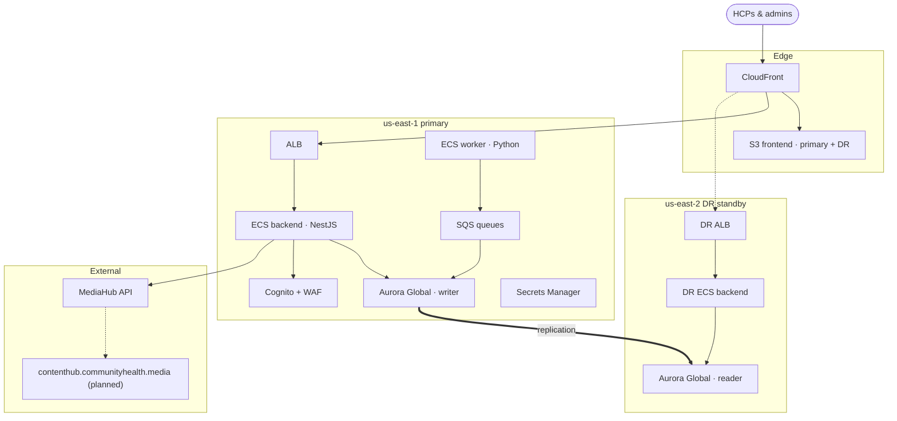

# Architecture

**Last updated:** June 2026  
**Account:** `233636046512`  
**Platform URL:** `testapp.communityhealth.media` · **Dev URL:** `devapp.communityhealth.media`

---

## High-level diagram

Source: [`diagrams/cht-platform-architecture.mmd`](./diagrams/cht-platform-architecture.mmd)

Export PDF: `./scripts/export-architecture-diagram.sh` → [`CHT-Platform-Architecture.pdf`](./cht-platform-architecture.pdf)

---

## Authentication

End-user auth is **Amazon Cognito** (not MediaHub GoTrue). Sessions are **httpOnly cookies** backed by Postgres.

Source: [`diagrams/cht-platform-auth.mmd`](./diagrams/cht-platform-auth.mmd) · PDF: [`cht-platform-auth.pdf`](./cht-platform-auth.pdf)

| Method | Flow |
|--------|------|
| Email / password | Frontend → `POST /api/auth/cognito/login` → Cognito → session cookie |
| Google OAuth | Cognito Hosted UI + Google IdP → `POST /api/auth/cognito/callback` |
| MFA | TOTP optional (`SOFTWARE_TOKEN_MFA`) |
| Bot protection | reCAPTCHA v3 on login/join (when keys configured) + Cognito WAF |

---

## Components

| Layer | Technology | Role |
|-------|------------|------|
| Frontend | React 18, Vite, Tailwind | HCP app, admin portal, public catalog |
| CDN | CloudFront + S3 | Static assets; primary + us-east-2 DR bucket |
| Backend | NestJS, Prisma | REST API, webhooks, Cognito auth, business logic |
| Worker | Python 3.11 | SQS consumers — email, payments, CME PDFs |
| Database (platform) | **Aurora PostgreSQL Global** | Writer us-east-1, reader us-east-2 |
| Database (dev) | RDS PostgreSQL + us-east-2 read replica | Unchanged |
| Auth | **Amazon Cognito** | User pool, Hosted UI, Google federation, MFA |
| Queue | SQS + DLQs | Async email, payment, CME jobs |
| Email | Amazon SES | Transactional mail (`noreply@communityhealth.media`) |
| Secrets | Secrets Manager | DB URL, API keys, Bill.com, Zoom, etc. |
| Content | MediaHub public API (`X-API-Key`) | Catalog clips, playlists, KOLs, HCP upsert — future domain **contenthub.communityhealth.media** |

---

## Key flows

### Session completion → payment

1. HCP attends a live session; Zoom webhooks record join/leave events.
2. HCP submits a JotForm post-event survey; webhook creates a `SurveyResponse`.
3. When attendance + survey criteria pass, backend queues a payment job on SQS.
4. Python worker calls Bill.com; honorarium is paid and status is updated in Aurora.
5. CME certificate PDF is generated and emailed via SES when applicable.

### Admin program scheduling

Admin creates a webinar or office hours session via the scheduler UI. Backend calls Zoom API, stores the `Program` in Postgres, and sends calendar invites. Optional: clone a JotForm survey template and attach it to the program.

### Content catalog

Frontend and backend fetch **MediaHub public API** content for disease-area playlists, KOL clips, and biomarker rows. YouTube playlists supplement podcast/audio content. Planned rename to **CHM Content Hub** at `contenthub.communityhealth.media` (API contract unchanged).

### DR / failover (platform)

| Layer | Primary | DR |
|-------|---------|-----|
| App traffic | us-east-1 ALB | CloudFront origin failover → us-east-2 ALB |
| Database | Aurora writer (us-east-1) | Aurora Global managed failover → us-east-2 writer |
| Frontend | S3 us-east-1 | S3 us-east-2 (synced deploy) |
| Auth | Cognito us-east-1 (+ MRR replica us-east-2) | Same pool; JWKS from primary region |

---

## Environments

| Environment | URL | Database | Terraform state |
|-------------|-----|----------|-----------------|
| Dev | `devapp.communityhealth.media` | RDS + cross-region replica | `us-east-1-dev`, `us-east-2-dev` |
| Platform | `testapp.communityhealth.media` | Aurora Global | `us-east-1`, `us-east-2` |

Both run in AWS account `233636046512`. Account-level services (GuardDuty, AWS Config, ECR replication) are managed from the **platform** stack.

---

## Health checks

- `GET /health` — liveness
- `GET /health/ready` — database connectivity (used by deploy workflows and ALB)
- `GET /actuator/info` — region, auth provider, image tag

---

## Related docs

- [Aurora Global migration runbook](../runbooks/aurora-global-platform-migration.md)
- [Cognito migration spec](../runbooks/cognito-migration-spec.md)
- [Multi-region DR runbook](../runbooks/multi-region-active-passive-us-east-2.md)
