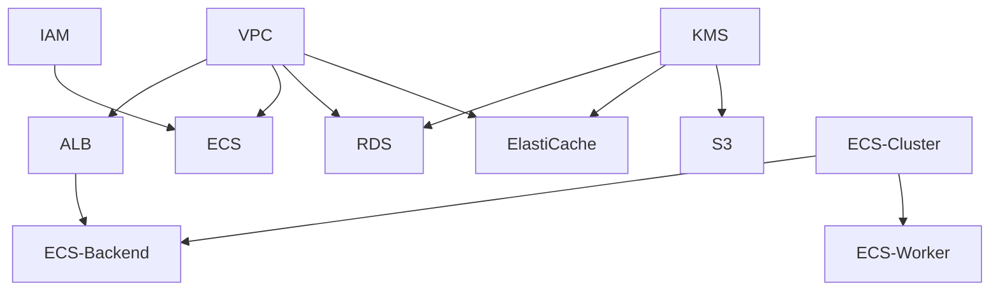

# Terraform Modules

## Directory Structure
```
modules/
├── networking/          # Network infrastructure
│   ├── vpc/            # VPC, subnets, NAT gateways
│   ├── alb/            # Application Load Balancer
│   ├── cloudfront/     # CloudFront distribution
│   └── route53/        # DNS management
├── compute/            # Compute resources
│   ├── ecs-cluster/    # ECS cluster
│   ├── ecs-backend/    # Backend service
│   └── ecs-worker/     # Worker service
├── database/           # Database resources
│   └── rds/            # PostgreSQL
├── cache/              # Caching layer
│   └── elasticache/    # Redis
├── storage/            # Object storage
│   ├── s3-frontend/    # Frontend assets
│   └── s3-certificates/# CME certificates
├── security/           # Security resources
│   ├── kms/            # Encryption keys
│   ├── iam/            # IAM roles
│   └── secrets-manager/# Secrets
├── messaging/          # Message queuing
│   └── sqs/            # SQS queues
└── monitoring/         # Observability
    └── cloudwatch/     # CloudWatch dashboards
```

## Usage

Each module is self-contained with:
- `main.tf` - Resource definitions
- `variables.tf` - Input variables
- `outputs.tf` - Output values
- `README.md` - Documentation

## Module Dependencies

